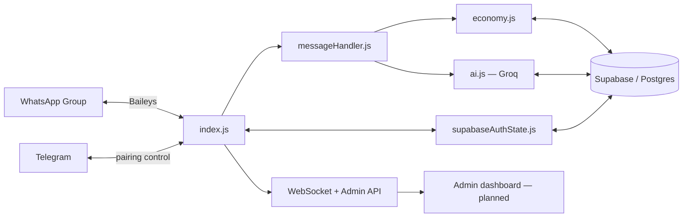

<div align="center">

# 🦩 Habibi

**A WhatsApp group bot with a full in-chat economy — currency, gambling, marriage, heists, and a merciless AI personality.**

Built to keep groups *active*, not to moderate them.

[](https://nodejs.org)
[](https://github.com/WhiskeySockets/Baileys)
[](https://supabase.com)
[](https://console.groq.com)
[]()

[Features](#-features) • [Commands](#-commands) • [Architecture](#-architecture) • [Getting Started](#-getting-started) • [Deployment](#-deployment) • [Roadmap](#-roadmap)

</div>

---

## 📖 Overview

Habibi lives in a WhatsApp group, tracks a running economy in **Habz (₻)**, and roasts everyone along the way. Every message earns currency, users level up, marry each other, run coordinated heists, and gamble it all away on a coinflip — while an AI personality (powered by Groq/Llama) jumps into conversation whenever it's tagged, mentioned by name, or replied to.

It's designed for one thing: giving a group a reason to keep talking.

## ✨ Features

| | |
|---|---|
| 🤖 **AI personality** | Replies when tagged, mentioned by name (`habibi`, `bibi`, `habs`), or replied to — powered by Groq, with per-user conversation memory and a locked-down anti-jailbreak identity |
| 💰 **Text-based economy** | Every message counts toward leveling; leveling up pays out |
| 📈 **Leveling system** | ₻100,000 awarded every 50 messages sent |
| 🪂 **Airdrops** | Admin-triggered drops, first to `.claim` takes it all |
| 🥷 **Stealing** | `.steal` a reply-target directly — 30% success, cooldown-limited |
| 🔫 **Heists** | `.rob` coordinates a 5-person crew via `.join` within a 10-second window — bypasses steal immunity entirely |
| 💍 **Marriage system** | Propose, accept, shared vault with deposits/withdrawals, 50/50 split on divorce |
| 🎲 **Gambling** | `.flip` — double or nothing |
| 🏆 **Global leaderboard** | Top 20 by balance, across all groups |
| 👋 **Auto-welcomes** | New members get roasted on arrival (skipped for bulk adds) |
| 🔒 **Group-only** | Ignores DMs and status broadcasts entirely |
| 🌍 **Multi-group** | One global wallet per user, shared across every group the bot is in |
| 📡 **Live admin feed** | WebSocket + REST admin API broadcasts every economy event in real time |

## 🎮 Commands

| Command | Description |
|---|---|
| `.help` / `.menu` / `.start` | List all commands |
| `.ping` | Health check |
| `.top` / `.leaderboard` | Global top 20 |
| `.profile` / `.balance` / `.bal` | Your balance, level, rank, steal record, marriage status |
| `.daily` | Claim your daily ₻25,000 |
| `.claim` | Claim an active airdrop |
| `.steal` *(reply)* | Attempt to steal from the replied user — 30% success |
| `.rob @user` | Start a heist crew — 50% odds, ignores immunity |
| `.join` | Join an active heist within its 10s window |
| `.give` / `.pay @user <amount>` | Send Habz (5% fee) |
| `.flip` / `.coinflip <amount>` | Double or nothing |
| `.immunity <hours>` | Buy steal protection — ₻2,000/hour |
| `.marry` / `.propose @user` | Propose marriage |
| `.accept` | Accept a pending proposal |
| `.divorce` | End it, vault splits 50/50 |
| `.vault` | Check your marriage vault |
| `.deposit <amount>` | Add Habz to the vault |
| `.withdrawal <amount>` | Pull Habz from the vault |

> A handful of admin-only moderation commands exist for the bot owner and are intentionally left out of `.help`.

## 🏗 Architecture



Session credentials, economy state, and AI chat history all live in Supabase — the bot itself is stateless, so redeploys and server migrations don't require re-pairing WhatsApp.

## 🧱 Tech stack

| Layer | Choice |
|---|---|
| Runtime | Node.js (ESM), [Baileys](https://github.com/WhiskeySockets/Baileys) for the WhatsApp Web protocol |
| Database | Supabase (PostgreSQL) — economy, sessions, chat history |
| AI | Groq — `llama-3.3-70b-versatile` |
| Pairing control | Telegram bot, owner-only |
| Process management | PM2 |
| Hosting | Oracle Cloud (Ampere A1, ARM) — Railway/Render configs also included as alternatives |
| Live updates | `ws` — broadcasts economy events for a future admin dashboard |

## 📁 Project structure

```
habibi-whatsapp/
├── index.js                  Entry point — WhatsApp connection, Telegram pairing, event wiring
├── package.json
├── Procfile                   Render/Railway process definition
├── render.yaml                 Render one-click deploy config
├── .env.example
└── lib/
    ├── economy.js              Wallet, steal, heists, marriage, immunity, coinflip, levels
    ├── messageHandler.js        Routes incoming messages: text counting, commands, AI triggers
    ├── ai.js                     Groq personality, anti-jailbreak, per-user chat history
    ├── supabaseAuthState.js       Baileys auth state backed by Supabase (survives redeploys)
    ├── adminApi.js                 REST admin API (leaderboard, broadcasts, balance adjustments)
    └── websocket.js                 Real-time event feed for the admin API
```

## 🚀 Getting started

**Requirements:** Node.js 18+, a [Supabase](https://supabase.com) project, a [Groq](https://console.groq.com) API key, and a Telegram bot token for pairing.

```bash
git clone https://github.com/iamevanss/Official-Habibi- habibi
cd habibi
npm install
cp .env.example .env   # fill in the values below
npm start
```

### Environment variables

| Variable | Purpose |
|---|---|
| `SUPABASE_URL` | Your Supabase project URL |
| `SUPABASE_SERVICE_KEY` | Supabase **service_role** key (not the anon key) |
| `TELEGRAM_BOT_TOKEN` | Bot token from [@BotFather](https://t.me/BotFather) |
| `TELEGRAM_OWNER_ID` | Your Telegram chat ID — only this ID can issue pairing/admin commands |
| `GROQ_API_KEY` | API key from console.groq.com |
| `ADMIN_SECRET` | Shared secret for the REST admin API + WebSocket feed |
| `PORT` | HTTP port (defaults to 3000; auto-set on Railway/Render) |

Once running, message your Telegram bot with `/start`, then `/pair <phone number>` (country code, no `+`) to link WhatsApp.

## ☁️ Deployment

Pick whichever fits your setup:

- **[DEPLOY-ORACLE.md](./DEPLOY-ORACLE.md)** — Oracle Cloud Always Free VPS (current production setup)
- **[DEPLOY.md](./DEPLOY.md)** — Railway
- **[DEPLOY-RENDER.md](./DEPLOY-RENDER.md)** — Render

## 🗺 Roadmap

- [x] Core economy — balances, levels, leaderboard
- [x] Stealing, heists, marriage, gambling
- [x] AI personality with per-user memory
- [x] Supabase-backed auth (survives redeploys, no re-pairing on migration)
- [x] REST admin API + real-time WebSocket event feed
- [ ] Cron scheduler — timed airdrops, midnight steal-reset, weekly leaderboard reset + recap
- [ ] Admin dashboard frontend

## 🤝 Contributing

This is currently a single-maintainer project. Issues and PRs are welcome — open an issue first for anything beyond a small fix so it can be discussed before you sink time into it.

## 📄 License

No license has been set yet — all rights reserved by default until one is added.

## 🙌 Credits

Built by **Stain**.

[](https://wa.me/2348132589873)
[](https://t.me/heisstain)
[](https://t.me/heisevanss)
[](https://www.instagram.com/heis_evanss?igsh=Z3cxYmZsYTdrOGtv)

### Special thanks

Ted • Milo Dev • Anthropic • Gemini
